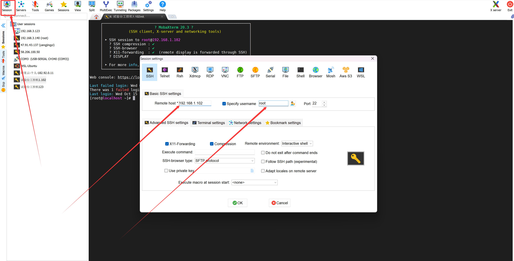
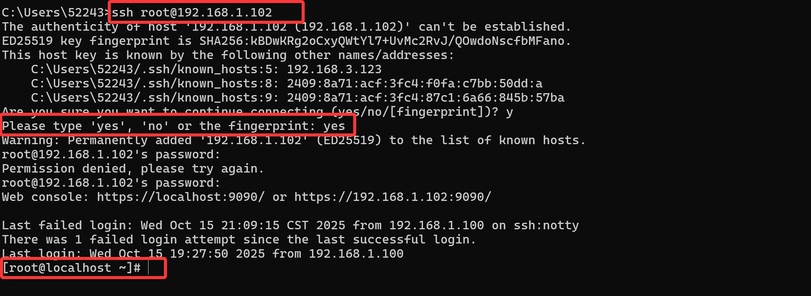
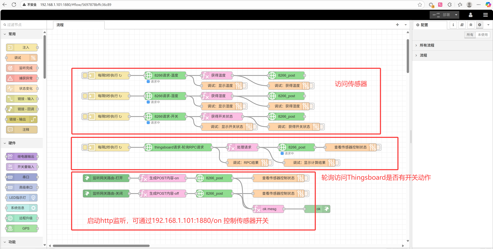
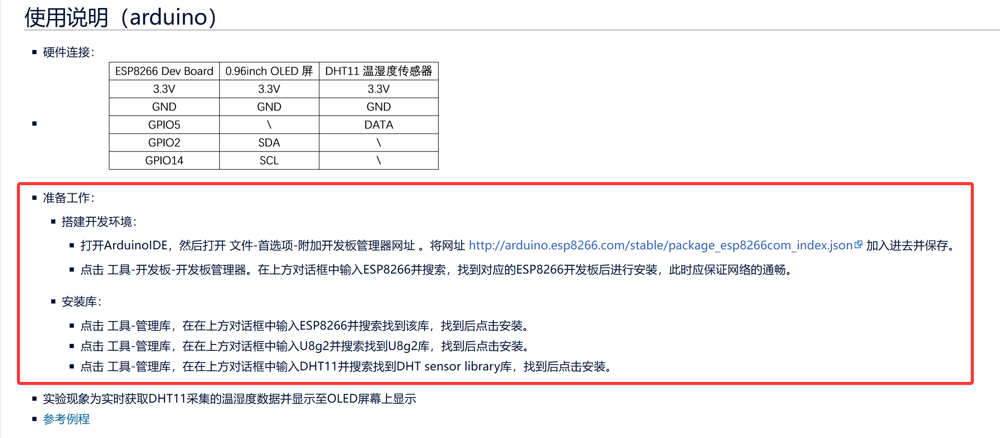

# Ai4EThingsPlatform

## 0 整体介绍

### 物联网架构

  

其中：

1. **工控机（主机）：** 采用`Docker`部署`ThingBoard`物联网平台，实现完善的设备管理功能，能够对连接到平台的各类物联网设备进行注册、认证、状态监控以及参数配置等操作；具备通过丰富的图表、图形等形式，将设备采集到的数据直观呈现。
2. **Liunx开发板（显示设备）：** 选用正点原子STM32MP157开发板搭配电容屏，安装Debian桌面系统，通过浏览器访问物联网平台。
3.	**工业路由器：** 作为交换机，连通各设备。
4.	**工业网关：** 有图形化编程功能，支持可视化拖拽式逻辑配置，支持 Modbus、MQTT、HTTP、TCP、UDP 等多种工业常见通信协议，可与各类工业设备、传感器、服务器等进行对接。
5.	**终端设备：** 采用`ESP8266`作为核心模块，搭载显示屏与温湿度传感器，通过相应的接口协议与网关进行通信。

### 运行效果

终端设备采集传感器数据，通过工业网关上传至工控机的物联网平台，再由物联网平台将数据发送至工控机进行处理和存储，显示设备访问工控机服务，展示设备数据，并实现对终端设备控制。

## 1 工业路由器

工控机、工业网关、开发板连接路由器LAN口组成一个局域网。其它电脑可以通过连接路由器Wifi访问它们。连接相关信息见铭牌。

网关本地管理界面，浏览器访问地址为：192.168.1.1。管理界面可查看局域网内各设备的IP地址，也可以对路由器相关信息进行修改。

紫色网线连接了路由器的WLAN端口，可插上别的交换机（路由器）连网。

路由器官方文档见[附件](assets\docs\路由器-R300A使用教程v2.0.0.pdf)

  

工控机地址：192.168.1.102
工业网关地址：192.168.1.101
开发板地址：192.168.1.103

## 2 工控机（主机）

### 登录

相关账号密码见铭牌。

登录可以采用Mobaxterm，远程软件。 
  

也可通过SSH进行远程连接。
  


### Thingsboard

**访问Thingsboard地址端口为8080（或者Browservice的80端口）**

用Docker安装了[Thingsboard社区版](https://thingsboard.io/)。并实现了数据展示与设备控制。

数据展示的逻辑见[Thingsboard教程](https://thingsboard.io/docs/getting-started-guides/helloworld/)。

设备控制的逻辑稍微不同：**网关不断向Thingsboard轮询RPC（Remote Procedure Call）请求，当设备控制的按钮有动作时，网关会收到结果。否则，网关的请求会一直等待。具体见网关的设置**。

### Browservice

Browservice是一个浏览器服务，主要的目的是提供一个简易版的服务，使得开发板的浏览器可以访问。由于开发板性能有限，直接访问Thingsboard无法加载全部的网页，因此需要使用Browservice提供代理服务将Thingsboard的网页渲染成图片。

Browservice将8080的Thingsboard服务映射到了80端口。

启动采用开机自启动，可以运行命查看Browservice状态:
```sysctl
systemctl status browservice.service
```

启动Browservice如下，`browservice.AppImage`是可执行文件：
```sysctl
sudo ./browservice.AppImage --vice-opt-http-listen-addr=0.0.0.0:80 --start-page=http://localhost:8080 --vice-opt-navigation-forwarding=yes --show-control-bar=yes --chromium-args=--no-sandbox
```

### 防火墙

运行服务需要启动防火墙，并开放相应的端口。其它主机才能访问，以下示例命令功能为`查看开发端口`，`永久添加8080端口`，`重新加载防火墙`。
```sysctl
sudo firewall-cmd --list-ports
sudo firewall-cmd --zone=public --add-port=8080/tcp --permanent
sudo firewall-cmd --reload
```

## 3 Linux开发板（显示设备）

开发板有三份附件：[快速体验手册](assets\docs\【正点原子】STM32MP157快速体验V1.8.pdf)、[文件传输手册](assets\docs\【正点原子】STM32MP157文件传输及更新固件手册V1.2.pdf)、[移植系统手册](assets\docs\【正点原子】STM32MP157移植Debian文件系统参考手册V1.0.pdf)。快速体验手册说明了初始系统烧录的方法,也可以观看[B站视频](https://www.bilibili.com/video/BV1Kr4y1u74L?spm_id_from=333.788.videopod.episodes&vd_source=272fd7cb1c2a2c55ba54b3733347b048&p=14)。

文件传输手册和移植系统手册说明了如何移植Debian系统文件系统。Debian系统自带浏览器和桌面系统，这也是为什么要移植Debian系统的原因。

## 4 工业网关

网关手册见[附件](assets\docs\网关-EG&EV系列_快速上手说明.pdf)

网关的已完成配置，作为中间层，不断读取传感器数据，将数据上传至工控机。并不断轮询访问工控机，进行设备控制信息。

  

网关的图形化配置界面中，**每个流程会自带`msg.payload`，也可以理解为流程所传递的信息就储存在`msg.payload`中。这个在流程设置界面不会体现，在函数编写时可以调用该信息**。具体见配置的示例。


## 5 终端设备

终端设备采用`ESP8266`作为核心模块，搭载显示屏与温湿度传感器，代码见[附件](ardunio\http_server.ino)。需要下载[Arduino IDE](https://www.arduino.cc/en/software)，Arduino IDE环境配置方法参考[文档]([ardunio\Arduino_IDE_环境配置.pdf](https://wiki.diustou.com/cn/ESP8266_Dev_Board))，核心内容如下图：

  

Arduino IDE打开代码烧录到8266板子即可。

这个Arduino代码实现了一个基于ESP8266的温湿度监测和设备控制系统，其连接网关的WiFi，在网关的局域网内，而不在路由器的局域网内，从板子的显示面板可以看到它的IP地址，是192.168.88.xxx，和路由器局域网不是一个网段。**可以理解为网关将终端设备和路由器局域网做了一层隔离**。

#### Arduino代码主要功能

1. **WiFi连接管理**
   - 自动连接指定的WiFi网络 (`Ai4E-EG8200`)
   - 支持连接状态监控和重连机制

2. **Web服务器功能**
   - 在端口80上运行HTTP服务器
   - 提供多个API接口：
     - [/](file://d:\develop\Ai4EThingsPlatform\ardunio\http_server.ino) - 返回HTML格式的温湿度数据显示页面
     - `/data` - 返回JSON格式的完整数据（温度、湿度、设备状态）
     - `/temperature` - 单独返回温度数据
     - `/humidity` - 单独返回湿度数据
     - `/device` - POST接口用于控制设备开关
     - `/deviceOn` - 返回设备当前开关状态

3. **传感器数据采集**
   - 使用DHT11传感器定期读取温湿度数据
   - 每2秒自动更新一次传感器读数
   - 数据存储在 `lastTemperature` 和 `lastHumidity` 变量中

4. **OLED显示屏**
   - 使用SSD1306 OLED屏幕显示实时信息
   - 显示内容包括WiFi状态、IP地址、温湿度数据和设备开关状态

5. **设备控制**
   - 支持远程控制设备开关状态
   - 设备状态存储在 `deviceOn` 布尔变量中

#### Arduino代码工作流程

代码采用状态机模式管理不同工作阶段：初始化 → WiFi连接 → 服务器启动 → 正常工作 → 异常处理，确保系统稳定运行。
