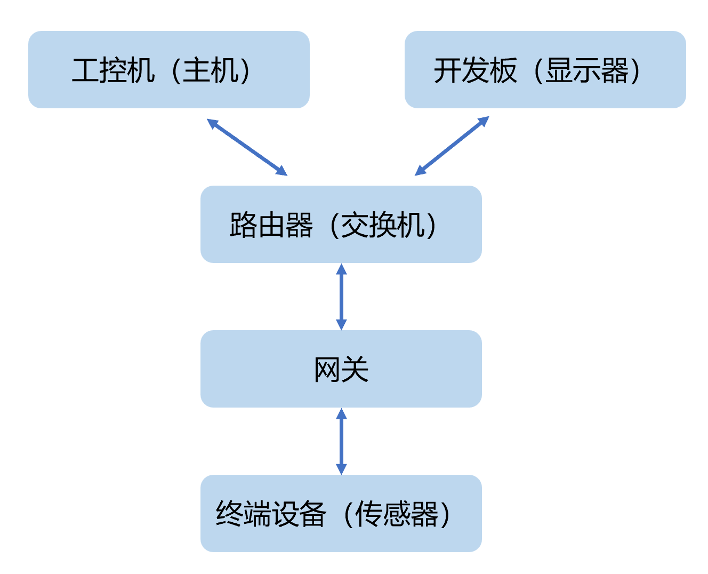
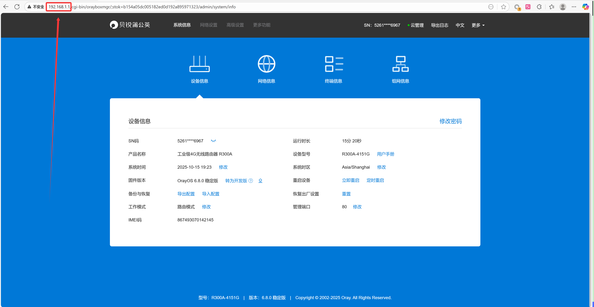

# Ai4EThingsPlatform

## 整体介绍

### 物联网架构

  

其中：

1. **工控机（主机）：** 采用`Docker`部署`ThingBoard`物联网平台，实现完善的设备管理功能，能够对连接到平台的各类物联网设备进行注册、认证、状态监控以及参数配置等操作；具备通过丰富的图表、图形等形式，将设备采集到的数据直观呈现。
2. **Liunx开发板（显示设备）：** 选用正点原子STM32MP157开发板搭配电容屏，安装Debian桌面系统，通过浏览器访问物联网平台。
3.	**工业路由器：** 作为交换机，连通各设备。
4.	**工业网关：** 有图形化编程功能，支持可视化拖拽式逻辑配置，支持 Modbus、MQTT、HTTP、TCP、UDP 等多种工业常见通信协议，可与各类工业设备、传感器、服务器等进行对接。
5.	**终端设备：** 采用`ESP8266`作为核心模块，搭载显示屏与温湿度传感器，通过相应的接口协议与网关进行通信。

### 运行效果

终端设备采集传感器数据，通过工业网关上传至工控机的物联网平台，再由物联网平台将数据发送至工控机进行处理和存储，显示设备访问工控机服务，展示设备数据，并实现对终端设备控制。

## 工业路由器

工控机、工业网关、开发板连接路由器LAN口组成一个局域网。其它电脑可以通过连接路由器Wifi访问它们。连接相关信息见铭牌。

网关本地管理界面，浏览器访问地址为：192.168.1.1。管理界面可查看局域网内各设备的IP地址，也可以对路由器相关信息进行修改。

紫色网线连接了路由器的WLAN端口，可插上别的交换机（路由器）连网。

  

工控机地址：192.168.1.102
工业网关地址：192.168.1.101
开发板地址：192.168.1.103

## 工控机（主机）

### 密码

相关账号密码见铭牌。

### Thingsboard

地址端口为8080

用Docker安装了[Thingsboard社区版](https://thingsboard.io/)。并实现了数据展示与设备控制。

数据展示的逻辑见[Thingsboard教程](https://thingsboard.io/docs/getting-started-guides/helloworld/)。

设备控制的逻辑稍微不同：网关不断向Thingsboard轮询RPC（Remote Procedure Call）请求，当设备控制的按钮有动作时，网关会收到结果。否则，网关的请求会一直等待。具体见网关的设置。

### Browservice

Browservice是一个浏览器服务，主要的目的是提供一个简易版的服务，使得开发板的浏览器可以访问。由于开发板性能有限，直接访问Thingsboard无法加载全部的网页，因此需要使用Browservice将Thingsboard的网页渲染成图片的代理服务。

Browservice将8080的Thingsboard服务映射到了80端口。

启动采用开机自启动，可以运行命查看Browservice状态:
```sysctl
systemctl status browservice.service
```

启动Browservice如下，`browservice.AppImage`是可执行文件：
```sysctl
sudo ./browservice.AppImage --vice-opt-http-listen-addr=0.0.0.0:80 --start-page=http://localhost:8080 --vice-opt-navigation-forwarding=yes --show-control-bar=yes --chromium-args=--no-sandbox
```

### 防火墙

运行服务需要启动防火墙，并开放相应的端口。其它主机才能访问，以下示例命令功能为`查看开发端口`，`永久添加8080端口`，`重新加载防火墙`。
```sysctl
sudo firewall-cmd --list-ports
sudo firewall-cmd --zone=public --add-port=8080/tcp --permanent
sudo firewall-cmd --reload
```

## Liunx开发板（显示设备）

## 工业网关

## 终端设备