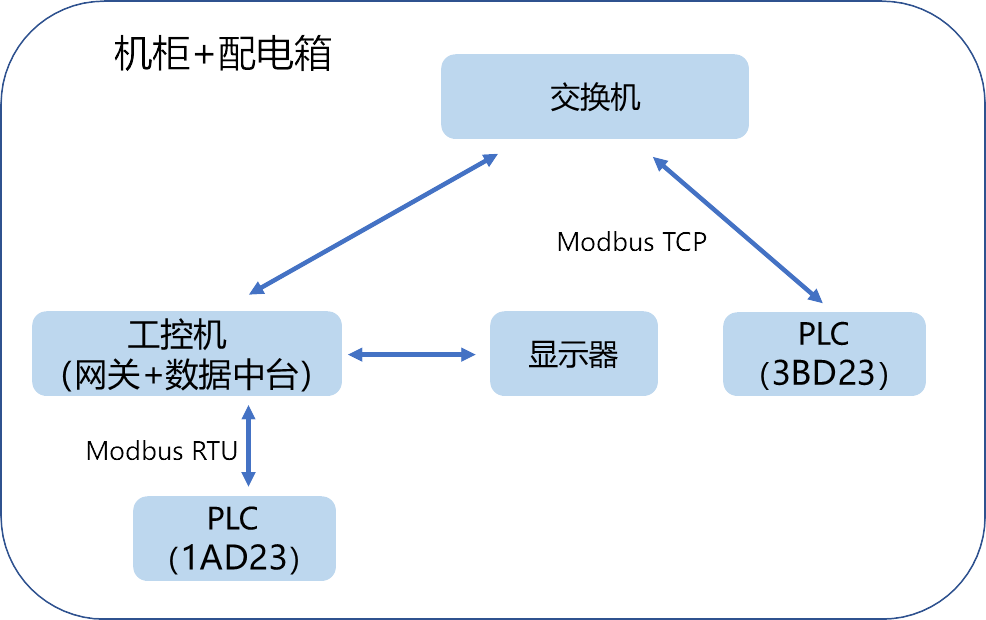

# 物联网 v3.0.0

## 0 整体介绍

### 架构

  

其中：

1. **工控机：** mqtt服务、网关数据采集服务、大屏显示都在此，采用Ubuntu24.04系统。
2. **显示器：** 可以直接登录工控机，同时配备鼠标键盘。
3.	**PLC：** 工控机使用Modbus RTU采集1AD23的数据（它没有网口）；使用Modbus TCP采集3BD23的数据。
4. **机柜：** 含配电箱，支架，logo等。

以上设备的IP均设为固定IP，在192.168.3.0/24网段内。

214-1AD23-0XB8 无IP，采用Modbus RTU
214-3BD23-0XB8 IP: 192.168.3.13
工控机 IP：192.168.3.14

**TIP：** 插上电源即可启动，打开各空开即可启动。交换机有配置时间，可等待交换机配置成功后启动工控机。

## 1 工控机

用户与密码：ai4energy/ai4energy，可以就地通过显示器使用本机，或者可以通过ssh进行远程访问。

### 1.1 Ubuntu 24.04 安装

装系统方法见[官方文档](https://documentation.ubuntu.com/desktop/en/latest/tutorial/install-ubuntu-desktop/)。若安装，需要准备一个U盘作为介质。

装机后需要进行apt换源等配置。

### 1.2 EMQX 安装（MQTT服务）

安装EMQX见[官方文档](https://www.emqx.com/zh/downloads-and-install/enterprise?os=Ubuntu)。

安装后自动设置开机自启动，可通过`sudo systemctl status emqx`查看状态，以及其它`sudo systemctl`的系列命令进行启动、停止、重启等配置。

### 1.3 网关

网关采用Python手搓，代码为[Gateway.py](Gateway.py)，通过两种方式读取了PLC中的随机数作为数据源。该代码配置成了Ubuntu系统的service，开机自启动。

#### 1.3.1 配置方法

1. 在`/home/ai4energy/gateway/`中放置了`Gateway.py`文件，并建立了虚拟环境：
```bash
python3 -m venv ai4energy
# 激活虚拟环境
source /home/ai4energy/gateway/ai4energy/bin/activate
```

2. 激活虚拟环境后，即可运行`Gateway.py`。

3. 配置开机启动，编辑service：`sudo nano /etc/systemd/system/gateway.service`
4. 配置内容见[gateway.service](v3.0\gateway.service)
5. 重新加载服务：`sudo systemctl daemon-reload`
6. 查看日志：`sudo journalctl -u gateway.service -f`

#### 1.3.2 RTU串口读取配置

在 Linux 中，硬件设备（如串口）是以特殊文件的形式存在于 /dev/ 目录下的：

/dev/ttyUSB0 - USB转串口设备，设备文件有特定的权限控制，普通用户默认无法直接访问。需要配置权限：

```bash
# 1. 添加用户到必要组，dialout 是 Linux 中专门用于串口设备访问的用户组
sudo usermod -a -G dialout $USER
sudo usermod -a -G tty $USER
# 2. 执行
newgrp dialout
# 3. 验证权限
groups $USER
```

#### 1.3.3 防火墙配置

使用ufw 进行防火墙配置。
1. 启动防火墙：`sudo ufw enable`
2. 配置规则：`sudo ufw allow 1883`
3. 验证防火墙状态：`sudo ufw status`

### 1.4 大屏显示

font文件夹中index.html文件为大屏显示文件，assets文件夹中为静态资源文件。

已配置为Ubuntu系统使用chrome的kiosk模式开机自启动:

```bash
google-chrome--stable --kiosk "/path/to/index.html"
```

按下atl+F4退出。

## 2 显示器

与一般电脑显示器一致。

## 3 PLC

PLC采用艾莫迅的200系列200系列PLC，型号为**214-3BD23-0XB8**和，**214-1AD23-0XB8**。其它型号与型号间的区别可查阅[选型手册](物理系统\plc\选型手册.pdf)，也可以在[官方文档](https://wiki.amsamotion.com/?title=196&doc=207)中查看。编程软件采用V4.0 STEP 7 MicroWIN SP9，[下载链接](https://www.ad.siemens.com.cn/download/materialaggregation_2190.html)及相关问题也可以在[文档](https://wiki.amsamotion.com/?title=5&doc=8)中查看。

PLC中主要功能为：
1. 启动Modbus TCP、Modbus RTU服务。
2. 生成随机数

梯形图文件为[plc\214-1AD23-0XB8程序.mwp](plc\214-1AD23-0XB8程序.mwp)和[plc\214-3BD23-0XB8程序.mwp](plc\214-3BD23-0XB8程序.mwp)。

PLC可用WIFI远程下载器进行程序下载，相关使用说明见[文档](物理系统\plc\远程下载器使用手册.pdf)，官方文档中亦有详细说明。


## 4 机柜与配电箱

Ai4Energy的定制版，配电箱含空气开关、漏电保护器、浪涌保护器。显示器支架。
