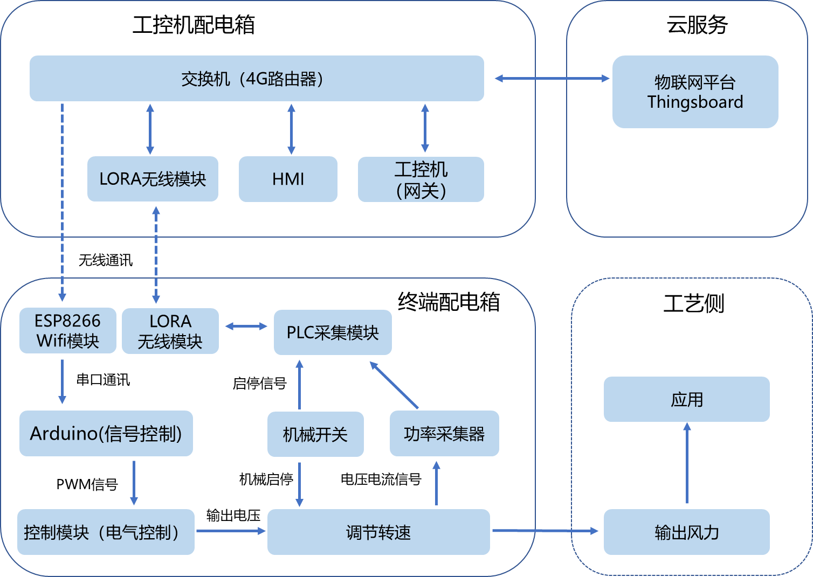

# 物联网 v4.0.0

## 0 整体介绍

### 架构

  

其中：

1. **物联网平台：** 采用Thingboard，部署在阿里云上。
2. **工控机：** Modus数据池，网关数据采集服务、物联网指令监听都在此，采用Ubuntu24.04系统。
3. **交换机：** 含4G上网模块，可连接公网阿里云。
4. **HMI：** 人机交互界面，可以就地查看系统状态。
5. **Arduino：** 通过串口接受工控机指令，并控制直流电机调速模块。
6. **控制模块** 根据不同PWM信号，输出不同电压，从而控制直流电机调速。具体原理见[v2.0文档](..\v2.0\README.md)。
7. **功率采集器：** 采集电压、电流信号，并通过无线传输方式发送给工控机。
8. **PLC采集模块：** 型号为ETH-MODBUS-IO8R-A。通过R485读取功率采集器数据，通过LOAR-EHT模块进行无线传输。
9. **LOAR-EHT模块** ： 无线传输模块。
10. **配电箱** 含安装结构件，支架，logo等。

以上设备的IP均设为固定IP，在192.168.3.0/24网段内：

1. ETH-MODBUS-IO8R-A IP：192.168.3.11；
2. LOAR-EHT模块-A Modbus TCP IP：192.168.3.12; Modbus TCP 远程IP：192.168.3.11；
3. LOAR-EHT模块-B Modbus TCP IP：192.168.3.13; 无需配置远程IP；
4. HMI IP：192.168.3.14；
5. ESP8266 IP：192.168.3.15；
6. 工控机IP：192.168.3.16。

## 1 物联网平台

物联网平台采用Thingboard，部署在阿里云上。公网IP地址为：47.106.20.36。

## 2 工控机

用户与密码：ai4energy/ai4energy，可以就地通过显示器使用本机，或者可以通过ssh进行远程访问。

### 2.1 Ubuntu 24.04 安装

装系统方法见[官方文档](https://documentation.ubuntu.com/desktop/en/latest/tutorial/install-ubuntu-desktop/)。若安装，需要准备一个U盘作为介质。

装机后需要进行apt换源等配置。

### 2.2 diagslave 安装

diagslave是一个程序，用于模拟PLC。它基于libmodbus，这是官方自带的标准Slave工具，libmodbus是全球工控领域最通用、最稳定的Modbus库。diagslave在这里就是一个 “公共数据池”，供HMI访问连接。

启动指令：`diagslave -m tcp -a 1 -p 502`

### 2.3 网关

网关采用Python手搓，代码为[Gateway.py](Gateway.py)，通过两种方式读取了PLC中的随机数作为数据源。该代码配置成了Ubuntu系统的service，开机自启动。

#### 2.3.1 配置方法

1. 在`/home/ai4energy/gateway/`中放置了`Gateway.py`文件，并建立了虚拟环境：
```bash
python3 -m venv ai4energy
# 激活虚拟环境
source /home/ai4energy/gateway/ai4energy/bin/activate
```

2. 激活虚拟环境后，即可运行`Gateway.py`。

3. 配置开机启动，编辑service：`sudo nano /etc/systemd/system/gateway.service`
4. 配置内容见[gateway.service](v3.0\gateway.service)
5. 重新加载服务：`sudo systemctl daemon-reload`
6. 查看日志：`sudo journalctl -u gateway.service -f`

#### 2.3.3 防火墙配置

使用ufw 进行防火墙配置。
1. 启动防火墙：`sudo ufw enable`
2. 配置规则：`sudo ufw allow 1883`
3. 验证防火墙状态：`sudo ufw status`

## 3 交换机

本质上是一个可连4G网的路由器。

## 4 HMI

可以手动输入PWM信号，并实时展示开关状态，电流、电压、功率数值。它的数值池为工控机本机的diagslave。

## 5 Arduino与ESP8266模块

由于本项目选择的Arduino（Uno R3）没有无线通讯手段，为了更好体现模块化，使得终端箱和工控箱完全隔离开来，采用ESP8266无线模块接受上位工控机指令，接收来自上位机的PWM信号，并转发给Arduino，实现电机调速。

## 6 控制模块

控制模块为PWM信号转为不同电压输出的硬件模块。型号为YF80S说明见[文档](assets\控制模块参数.jpg)。本质上它将控制信号与供能电路隔离开，本项目中使用的是24V的直流电机，其它工作电压的电机亦可。

## 7 功率采集器

本设备为PLC采集模块的一个从站。相关使用说明见[文档](assets/功率采集器参数.jpg)，示例代码为[PLC采集模块.py](\python\电压电流读取示例.py)。

pymodbus的函数本质上是对Modbus TCP协议进行封装，因此不需要写报文的二进制码，只需要给函数传递**寄存器地址、寄存器类型**等参数，即可获取数据。

## 8 PLC采集模块

本站站号为2。功率采集器为它的从站，站号1。模块本体采集开关是否打开的模拟量，示例代码为[PLC采集模块.py](python\开关按钮数字量读取示例.py)。


相关使用说明见[文档](plc\ETH-MODBUS-IO8R-A数据采集模块手册.pdf)，官方文档中亦有详细说明。

## 9 LOAR-EHT模块

该模块的本质为无线传输模块，工控机连接LOAR-EHT模块-B，对于工控机来说，LOAR-EHT模块-B是一个TCP Server，工控机作为TCP Client去访问LOAR-EHT模块-B。

随后，LOAR-EHT模块-B会把消息原封不动的进行转发，通过LORA无线传输方式转发给LOAR-EHT模块-A，随后，LOAR-EHT模块-A作为TCP Client，去访问作为TCP Server的ETH-MODBUS-IO8R-A模块，该模块提供了Modbus TCP服务，提供了接口去读取功率采集器的数据。

因此，只需要配置作为TCP Client的LOAR-EHT模块-A需要去访问的IP地址（即ETH-MODBUS-IO8R-A模块的地址），即可实现整个链路的通讯。工控机需要按照Modbus TCP访问的方式去直接访问LOAR-EHT模块-B，即可间接的完成对ETH-MODBUS-IO8R-A的访问。
